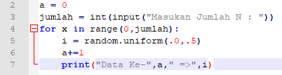
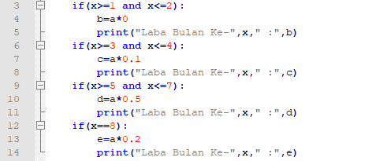

#Penjelasan Alur Algoritma

#LATIHAN1
1. Modul Random

	Modul random menyediakan fast pseudorandom number generator berdasarkan algoritma Mersenne Twister.

	Contoh : 

2. for loop

	Perulangan for disebut counted loop (perulangan yang terhitung)
	perulangan for biasanya digunakan untuk mengulangi kode yang sudah diketahui banyak perulangannya.

	contoh : 
	
	

	Variabel x berfungsi untuk menampung indeks, dan fungsi range() berfungsi untuk membuat list dengan range yang kita tentukan.
	Fungsi print() berfungsi untuk mencetak atau menampilkan objek ke perangkat keluaran (layar) atau ke file teks.
	

#Latihan2
1. print

	Fungsi print() berfungsi untuk mencetak atau menampilkan objek ke perangkat keluaran (layar) atau ke file teks.
	
	contoh :
	
	
	
2. while loop

	perulangan while disebut uncounted loop (perulangan yang tak terhitung).
	while untuk perulangan yang memiliki syarat dan tidak tentu berapa banyak perulangannya dengan pernyataan break.
	pernyataan break digunakan untuk mengehentikan proses perulangan dengan kondisi tertentu.
	pertama menentukan variabel untuk max untuk mencari nilai terbesar dari data yang pengguna inputkan,
	dan menentukan kapan perulangan berhenti. Jika pengguna menjawab 0 (Nol) perulangan akan terhenti.
	Setelah selesai mengulang, cetak bilangan terbesar dari beberapa data yang di inputkan.
	
	Berikut adalah contoh programnya :
	
	
	

#Program1
1. for

	Petama kita tentukan nilai variabel

	

	Variabel x berfungsi untuk menampung indeks, dan fungsi range() berfungsi untuk membuat list dengan range dari 1-10.

	

2. if statment

	Fungsi IF memungkinkan pengguna untuk membuat perbandingan logis antara nilai dan apa yang diharapkan dengan menguji
	kondisi dan mengembalikan hasil jika True atau False.
	
	
	
	TOTAL untuk mengakumulasikan hasil dari program operator yang ada di statment IF.
	Fungsi print() berfungsi untuk mencetak atau menampilkan objek ke perangkat keluaran (layar) atau ke file teks.
	
	

